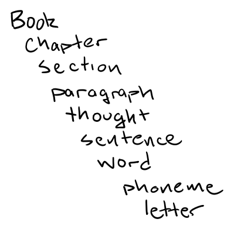

# Gaia NLP

## Summary

Gaia NLP is a paragraph-embedding on a node graph that provides summary and answers the question "How similar is A to B?" where A and B are thoughts identified in a single corpus.  It uses [fuzzy concepts](https://en.wikipedia.org/wiki/Fuzzy_concept) to build a [latent space](https://en.wikipedia.org/wiki/Latent_space) of **thoughts** which are, technically, paragraph vectors ala  with some secret sauce. The website [knowing-gaia.net](https://knowing-gaia.net/) is used as an example as it has a repetitive narrative structure with labeled topics and lens well-suited for testing clustering and classification models. 

### Prior art

### Embeddings

Traditional [word](https://arxiv.org/abs/1301.3781) and [paragraph](https://cs.stanford.edu/~quocle/paragraph_vector.pdf) embedding preserve little to no sentence structure, relying instead on word proximity and occurrence statistics. As a baseline, we'll use [LSA](https://en.wikipedia.org/wiki/Latent_semantic_analysis) and compare it to [LDA](https://en.wikipedia.org/wiki/Latent_Dirichlet_allocation) to see what unsupervised clustering of thoughts yields.

The hyper parameters of the model influence the stochastically determined mapping from written English to a latent space of thoughts. This is similar to how [UMAP](https://umap-learn.readthedocs.io/en/latest/how_umap_works.html) (uniform manifold approximation and projection) deforms the manifold based on nearest neighbor information.

### Seq2Seq

[Sequence to Sequence Learning with Neural Networks](https://arxiv.org/abs/1409.3215) by Ilya Sutskever, Oriol Vinyals, Quoc V. Le, 2014. Uses LSTM to map sequences to a fixed length and another LSTM  to decode the target sequence of the vector.

[Sequence-to-Sequence Learning as Beam-Search Optimization]() by Sam Wiseman and Alexander M. Rush, 2016. 

[Learning Neural Templates for Text Generation](https://arxiv.org/abs/1808.10122) 2018 by Sam Wiseman, Stuart M. Shieber, Alexander M. Rush. Because English relies on conventions for syntax and typical syntax pattern, Wiseman et. al present a scheme that accounts for, and takes advantage of, template based formatting for input vectors.

### Transformers

The transformer model described by [Attention is All You Need](https://arxiv.org/pdf/1706.03762.pdf) from 2018 is clearly explained in this [walk-thru](http://nlp.seas.harvard.edu/annotated-transformer/).  The transformer model is impressive but not suited for unsupervised learning on a small corpus which we are attempting to summarize (reduce) in a meaningful way.

### Graph networks

The [TextRank](https://web.eecs.umich.edu/~mihalcea/papers/mihalcea.emnlp04.pdf) algorithm by Rada Mihalcea and Paul Tarau is the starting point for the theory behind Gaia NLP. Like TextRank, Gaia NLP summarizes and contextualizes a corpus using graph based, unsupervised techniques. 

See Chapter 5 "Geometric Deep Learning Models" of Bronstein et. al's [Geometric Deep Learning
Grids, Groups, Graphs, Geodesics, and Gauges](https://arxiv.org/pdf/2104.13478.pdf) for explainations of how graph neural networks are used in conjunction with sequence based models like LSTM and transformers with attention.

Prakhar Mishra's short walk-thrus are good:
 - [TextRank: Bringing Order into Texts](https://www.youtube.com/watch?v=2l6Fa767kEw)
 - [Node2Vec: Scalable Feature Learning for Networks | ML with Graphs ](https://www.youtube.com/watch?v=LpwGZG5j_q0)
 - [DEEPWALK: Online Learning of Social Representations](https://www.youtube.com/watch?v=-uJL_ANy1jc)

### Relevant historical papers

- 1977 beam search paper, [Word Reordering and a Dynamic
Programming Beam Search Algorithm for
Statistical Machine Translation](https://aclanthology.org/J03-1005.pdf)  by Christoph Tillmann and Hermann Ney. The paper introduces beam search- a statistical machine translation
based on [dynamic programming](https://en.wikipedia.org/wiki/Dynamic_programming). This is a good rosetta stone algorithm between the fields of NLP and [computational genomics](https://en.wikipedia.org/wiki/Computational_genomics).

- Xi Rong's [word2vec Parameter Learning Explained](https://arxiv.org/abs/1411.2738) walks through a toy model that clearly explains bag of words, skip-gram, hierarchical soft-max and negative sampling.

- Socher, Bauer, Manning and Ng might be called the Beatles of NLP. Their paper [Parsing with Compositional Vector Grammars](https://nlp.stanford.edu/pubs/SocherBauerManningNg_ACL2013.pdf) crystallized the vague notion of augmenting tokens with parts of speech and using this information to create a latent space that honors syntax and meaning and not just meaning itself. 

- Other papers from Socher et. al: [Semi-Supervised Recursive Autoencoders for Predicting Sentiment Distributions](https://aclanthology.org/D11-1014.pdf), [Improved Semantic Representations From Tree-Structured Long Short-Term Memory Networks](https://arxiv.org/abs/1503.00075), [Glove: Global Vectors for Word Representation](https://aclanthology.org/D14-1162.pdf), [Recursive Deep Models for Semantic Compositionality Over a Sentiment Treebank](https://aclanthology.org/D13-1170.pdf)

# Latent Semantic Analysis

Essentially, gaia-nlp is a mashup of LDA (latent Dirichlet allocation) and UMAP with the criteria that the model inputs are always two sentences long and labeled with parts of speech. Thus, correlations in the latent space are between complete thoughts and not short phrases (n-grams) or long documents (over feeding doc2vec).

## Corpus structure

Gaia NLP augments Mikolov's word + document scheme with SpaCy's token annotations while also insisting on inputs of exactly two sentences. This is to establish an arbitrary, but human-sized, sweet spot between conceptual fidelity and inferential generalization.

This annotated two-sentence sample is called a **thought** and it's [embedding](https://en.wikipedia.org/wiki/Embedding) is called **thought manifold**. The shape and resolution of [manifold](https://en.wikipedia.org/wiki/Manifold) is influenced by hyper parameters of shape ($\omega$), resolution ($\sigma$), scale ($s$).

## Adding structure with SpaCy Doc

### Structurally a Gaia Thought is a list of SpaCy tokens of two sentences.

In general, doc2vec and dimensional reduction methods over a latent space can only handle short 'documents'. Its important to remember that doc2vec augments the original word2vec scheme, the intent here is to give the word embeddings more umph and less about mapping and recalling the gist of an entire 'document'.

Said another way, in the doc2vec genre of NLP, a **document is closer to a sentence than an article.** 

A short paragraph? Yes, that's an NLP document. A long sentence? Definitely. Two long sentences? Okay. Four long sentence? Pushing it. Two paragraphs? No way! That would be two documents.

## Gaia-nlp maps annotated paragraph into a single latent space involving individual words and thoughts.

Thoughts are subject to the following constraints:

- Exactly 2 sentences
- Overlapping sentence input
  - first sentence at $t_1$ will be second sentence at $t_2$
- classified with POS and NER

A thought can do one of the following:
1. equate a sentiment with an statement ([FuzzySet](https://en.wikipedia.org/wiki/FinSet))
1. describe a relation between two nouns ([FinSet](https://en.wikipedia.org/wiki/FinSet))
1. describe a relation between two verbs ([functor](https://en.wikipedia.org/wiki/Functor))
1. describe a relative between verb and noun ([simplical set](https://en.wikipedia.org/wiki/Simplicial_set))

You may think of a thought vector as short paragraph vector with syntax annotations that help identify a thought as either an attribute of fuzzy sentiment or declaration of correlation with probability of causation.

### Thoughts can be related to topics
As a corpus grows, so too can the size of the document size (chunk size). But as document (chunk) size grows, the more data one needs to either 'fill out' a latent space spanning more concepts, or, 'fill in' nuances about a limited number of topics. In the second case, we are better off using LDA for topic classification. Let's take a look at LDA of data now.

### A Thought is two sentences.

Let's say a a thought is composed of two sentences that you can speak over 4 seconds. So, rhythmically, at 120bpm (average walking tempo) one can express one thought in two measures (bars). This means a rhyme over 8 bars would be four complete thoughts. Let's call that a [concept](https://en.wikipedia.org/wiki/Concept).

## A Section is a semi-ordered collection of Concepts.

Because we define a thought with two sentences, we assume it is rich enough to stand on 
its own and that the order of **thoughts** in a **concept** does not always matter and the 
order of concepts in a section matters even less. That is to say, the courser the grain, the less order matters. This tracks with intuition - statements of causality are naturally ambiguous for an expanding set of considerations and concepts.

A [Simplicial set](https://en.wikipedia.org/wiki/Simplicial_set) is an appropriate structure to represent a section.

### Encoding causality

To encode causal inference, a partial order must be honored. 

The [Annotated Transformer](http://nlp.seas.harvard.edu/annotated-transformer/) is a good summary the famous Attention is all You Need which describes temporal encoding. Research on the value of retaining sequence information is warranted.

### The syntax of a paragraph.

Quoc Le and Tomas Mikolov's [Distributed Representations of Sentences and Documents](https://github.com/study-groups/nlp-study-group#papers) is considerer 'the' doc2vec paoer. They use an aggregation abstraction called a Paragraph Vector. We will do the same. We use SpaCy's Doc structure to encode paragraphs as a sequence of tokens. The encoding scheme is determined by the model.

### Coarse Grain / Fine Grain

Similar to bin sizes for a histogram of stationary data, one must decide how much detail we want our embedded space to capture. And, like bin size, more resolution requires more training data.  
Unlike choosing a bin size over the domain of a single random variable, the resolution of embedded spaces are multidimensional with each dimension having arbitrary resolution. Furthermore, the number of dimensions of the space is at the description of the model.

## Latent space consideration

A 45 page document that covers 8 topics with 10 probes covers more [latent space](https://en.wikipedia.org/wiki/Latent_space) when the topics are disimilar (more bins).

One of the first things we'll do is look the Chapter headings for an intuition of similarity and differences. This is a subjective activity and requires the participant to instantiate sentiments from their own latent space (brain).

### The goal is understanding Entropy

In thermodynamics, the internal energy of a system is expressed in terms of pairs of conjugate variables such as temperature and entropy or pressure and volume.

This brings us to the goal of this notebook: to show the size (temperature) of a paragraph is 
in congugate relation with the descriptive power (entropy) of model. Further more, unlike the physical sciences, sentiment analysis takes place in single latent spaces of people's min

## Sentiment Analysis

https://realpython.com/sentiment-analysis-python/
